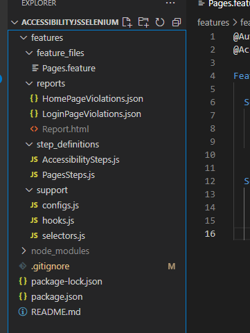

# AccessibilityJSSelenium

This repo has the code which implements a Accessibility Tests for the website, https://www.saucedemo.com/ using the Axe Core Library. The framework uses BDD (Cucumber.js), Selenium and JavaScript

Project setup guide is available in the PDF doc [AccessibilityJSSelenium.pdf](AccessibilityJSSelenium.pdf)

### **Folder Structure**

